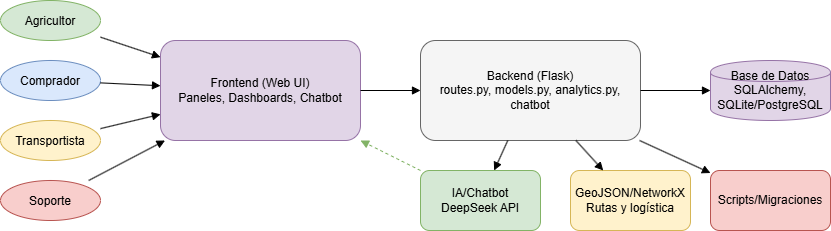

# AgroGrid – Mapeo Completo y Arquitectura

## 1. Propósito General

**AgroGrid** es una plataforma web que conecta agricultores, compradores y transportistas en Ecuador, facilitando la compra, venta y logística de productos agrícolas. Ofrece paneles personalizados, análisis de datos, gestión de pedidos, rutas inteligentes y soporte por chatbot con IA (DeepSeek).

---

## 2. Estructura de Carpetas y Archivos

```
Agrogrid/
|
|-- app/
|   |-- __init__.py
|   |-- analytics.py                # Análisis de ventas, compras y paneles (Numpy/Pandas)
|   |-- analytics_historial.py      # Análisis histórico de datos
|   |-- chatbot_knowledge.py        # Base de conocimientos para respuestas instantáneas del chatbot
|   |-- chatbot_prompts.py          # Prompt y configuración del chatbot (DeepSeek)
|   |-- controllers.py              # Lógica de controladores (MVC)
|   |-- decision_tree_seguro.py     # Árbol de decisión para seguros agrícolas
|   |-- grafo_transporte.py         # Lógica de grafos y rutas (NetworkX)
|   |-- models.py                   # Modelos de base de datos (SQLAlchemy)
|   |-- routes.py                   # Todas las rutas Flask (API, vistas, autenticación, chatbot, paneles)
|   |-- taxonomia.py                # Taxonomía de productos y categorías
|   |-- token_utils.py              # Utilidades para manejo de tokens
|   |-- ubicacion.py                # Lógica de ubicación y geolocalización
|   |-- utils/
|   |   |-- __init__.py
|   |   |-- recomendador.py         # Algoritmo de recomendación de productos
|   |   |-- sorting.py              # Algoritmos de ordenamiento
|   |   |-- readme.txt
|   |-- static/
|   |   |-- css/                    # Estilos CSS (por rol/página)
|   |   |-- js/                     # Scripts JS (por rol/página)
|   |   |-- images/                 # Imágenes y logos
|   |   |-- uploads/                # Archivos subidos por usuarios
|   |   |-- barplot_envios.png      # Gráficos generados
|   |-- templates/
|   |   |-- base.html               # Plantilla base
|   |   |-- index.html              # Inicio
|   |   |-- login.html, register.html, etc.
|   |   |-- agricultor/             # Vistas específicas de agricultor
|   |   |-- comprador/              # Vistas específicas de comprador
|   |   |-- transportista/          # Vistas específicas de transportista
|   |   |-- partials/               # Componentes parciales (navbar, footer)
|   |   |-- email/                  # Plantillas de correo
|
|-- geojson/                        # Archivos geográficos para rutas y análisis espacial
|-- scripts/                        # Scripts de automatización y carga de datos
|-- migrations/                     # Migraciones de base de datos (Flask-Migrate/Alembic)
|-- .env                            # Variables de entorno (API keys, configs)
|-- config.py                       # Configuración global del proyecto
|-- requirements.txt                # Dependencias del proyecto
|-- README.md                       # Documentación general y guía de uso
|-- run.py                          # Script principal para lanzar la app Flask
|-- app.db                          # Base de datos SQLite local
|-- crear_tablas_sqlalchemy.py      # Script para crear tablas
|-- poblar_coordenadas_cantones.py  # Script para poblar coordenadas
|-- poblar_grafo_ors.py             # Script para poblar grafo de rutas
|-- poblar_grafo_vecinos.py         # Script para poblar grafo de vecinos
|-- grafo_cantonal_geodesico.json   # Grafo de rutas geodésicas
|-- grafo_cantonal_vecinos.json     # Grafo de vecinos
|-- test_openrouter.py              # Test de integración de IA
|-- testingdb.py, ver_bd_estructura.py, ver_cantones_latlon.py # Utilidades de base de datos
```

---

## 3. Principales Módulos y Funcionalidades

### Backend (Flask)
- **app/routes.py:** Todas las rutas de la API y vistas web, integración con DeepSeek para el chatbot, lógica de paneles, autenticación, compras, ventas y logística.
- **app/models.py:** Modelos de usuario, producto, orden, carrito, vehículo, viaje, testimonio, etc.
- **app/analytics.py:** Análisis y agregación de ventas/compras, paneles de usuario.
- **app/chatbot_knowledge.py:** Preguntas frecuentes y respuestas instantáneas (minimiza uso de LLM).
- **app/chatbot_prompts.py:** Prompt optimizado para DeepSeek, instrucciones y contexto para el chatbot.
- **app/grafo_transporte.py:** Algoritmos de rutas y logística con NetworkX.
- **app/utils/**: Algoritmos de recomendación y utilidades.

### Frontend (Jinja2, JS, CSS)
- **app/templates/**: Plantillas HTML para cada rol, paneles, carrito, testimonios, ayuda, etc.
- **app/static/css/**: Estilos para cada panel y página.
- **app/static/js/**: Scripts para interacción, dashboards, paneles, chatbot, etc.

### Otros
- **geojson/**: Mapas y datos espaciales para rutas y análisis logístico.
- **scripts/**: Automatización, carga de datos, pruebas.
- **migrations/**: Control de versiones de la base de datos.

---

## 4. Integraciones y Seguridad

- **DeepSeek API:** Chatbot Gridi responde usando DeepSeek (API key en `.env`).
- **Flask-Login:** Autenticación de usuarios y gestión de sesiones.
- **Flask-Mail:** Notificaciones y recuperación de contraseña.
- **NetworkX:** Cálculo de rutas óptimas para logística.
- **Numpy/Pandas:** Análisis de datos de ventas y compras.
- **SQLAlchemy:** ORM para la base de datos.
- **Privacidad:** Datos sensibles protegidos, sin exposición en chatbot ni interfaz.

---

## 5. Flujos de Usuario

- **Agricultor:** Publica productos, gestiona ventas, analiza panel, recibe pagos/calificaciones.
- **Comprador:** Explora catálogo, compra, visualiza panel de compras, historial, estadísticas.
- **Transportista:** Registra vehículo, acepta viajes, visualiza rutas y calificaciones.
- **Soporte:** Acceso administrativo y ayuda.

---

## 6. ¿Cómo iniciar el proyecto?

1. Clonar el repositorio y crear entorno virtual.
2. Instalar dependencias (`pip install -r requirements.txt`).
3. Configurar `.env` con claves y variables.
4. Ejecutar migraciones y scripts de carga si es necesario.
5. Ejecutar `python run.py` para lanzar la app.
6. Acceder vía navegador y probar paneles, chatbot, compras, ventas, rutas, etc.

---

## 7. Diagrama de Arquitectura Visual y Flujos



- **Frontend:** Plantillas HTML (Jinja2), CSS, JS → Interfaz de usuario y paneles.
- **Backend:** Flask (routes.py, models.py, analytics.py, chatbot, lógica de negocio)
- **Base de Datos:** SQLAlchemy (SQLite, PostgreSQL, etc.)
- **IA/Chatbot:** DeepSeek API
- **GeoJSON/NetworkX:** Rutas y logística
- **Scripts y migraciones:** Automatización y mantenimiento

**Flujos principales:**
1. Usuario accede a la web, inicia sesión y navega su panel según rol.
2. Puede comprar, vender, transportar o solicitar soporte.
3. El chatbot responde preguntas frecuentes con la base de conocimientos y usa DeepSeek para consultas complejas.
4. Los datos de compras, ventas y rutas se analizan y muestran en paneles personalizados.

---

> **Nota:** El diagrama visual debe generarse y guardarse como `AgroGrid_Arquitectura.png` en la raíz del proyecto para ser incluido en el PDF final.


-----------------------------------------

# Informe de Proyecto: AgroGrid

---

## I. Lenguaje(s) de programación utilizado(s)

- **Python** (backend, scripts, lógica de negocio)
- **HTML, CSS, JavaScript** (frontend, plantillas, dashboards)
- **SQL** (consultas a base de datos vía SQLAlchemy)
- **JSON** (formato de datos para chatbot)
- **GeoJSON** (formato de datos para rutas y logística)
- **NetworkX** (algoritmos de grafos para rutas y logística)
- **Pandas** (análisis de datos para paneles y reportes)
- **Numpy** (algoritmos de ordenamiento para paneles y reportes)
---

## II. Descripción del proyecto

**Resumen del proyecto (máx. 150 palabras):**  
AgroGrid es una plataforma web que conecta agricultores, compradores y transportistas en Ecuador para facilitar la compra, venta y logística de productos agrícolas. Ofrece paneles personalizados, análisis de datos, gestión de pedidos, rutas inteligentes y soporte por chatbot con IA, optimizando la cadena agroalimentaria nacional.

**Objetivo general:**  
Facilitar y digitalizar la gestión agrícola, comercial y logística en Ecuador mediante una plataforma web colaborativa.

**Objetivos específicos:**
- Permitir a agricultores publicar productos y gestionar ventas.
- Facilitar a compradores la búsqueda, compra y seguimiento de productos agrícolas.
- Integrar transportistas para optimizar rutas y entregas.
- Proveer análisis y reportes automáticos para cada usuario.
- Ofrecer soporte inteligente vía chatbot IA (DeepSeek).

**Problema que resuelve el proyecto:**  
La desconexión y falta de digitalización en la cadena de suministro agrícola, la dificultad de acceso a mercados, y la ineficiencia logística.

**Justificación del proyecto:**  
AgroGrid mejora la eficiencia, transparencia y trazabilidad del sector agrícola, beneficiando a todos los actores y fomentando la digitalización rural.

---

## III. Diseño y estructura del sistema

**Diagrama de clases / actividades:**  
  
*(Incluye aquí el diagrama generado en Draw.io)*

**Estructuras de datos aplicadas (especificar y justificar su uso):**
- **Tablas relacionales (SQLAlchemy):** Para usuarios, productos, órdenes, etc.
- **Listas y diccionarios (Python):** Para manejo de datos temporales y respuestas del chatbot.
- **Grafos (NetworkX):** Para cálculo de rutas logísticas óptimas entre cantones.
- **DataFrames (Pandas, Numpy):** Para análisis de ventas y compras. 

**Algoritmos implementados:**
- **Dijkstra:** Para encontrar la ruta de envío más corta entre localidades.
- **K-Nearest Neighbors (KNN):** Para recomendar productos basándose en compras de usuarios con gustos similares.
- **Algoritmos de ordenamiento (QuickSort, MergeSort):** Para ordenar y mostrar productos por ventas, vistas o fecha.
- **Agregaciones estadísticas (Pandas, Numpy):** Para calcular y mostrar datos en paneles de ventas, compras y reportes.

**Capturas de pantalla o evidencia del desarrollo:**  
*(Agrega aquí capturas de la interfaz web, paneles, chatbot, etc.)*

**Descripción de funcionalidades principales:**
- Registro y autenticación de usuarios por rol.
- Publicación y compra de productos agrícolas.
- Gestión de pedidos y logística de transporte.
- Paneles de análisis para cada usuario.
- Chatbot inteligente para soporte y consultas frecuentes.

---

## IV. Desarrollo técnico

**Lenguaje y Entorno de Desarrollo:**
- **Backend:** Python 3.x sobre el framework Flask.
  - **Librerías Clave:** SQLAlchemy (ORM), Pandas y Numpy (Análisis de datos), NetworkX (Grafos), Scikit-learn (Machine Learning), Flask-Login (Autenticación).
- **Frontend:** HTML5, CSS3, y JavaScript, con el motor de plantillas Jinja2 para la renderización dinámica.
- **Base de Datos:** SQLite para el entorno de desarrollo y PostgreSQL para producción, gestionado a través de SQLAlchemy.
- **Control de Versiones:** Git y GitHub.
- **Entorno de Trabajo:** Visual Studio Code sobre Windows, con gestión de paquetes vía `pip`.

**Estrategia de Programación Aplicada:**
Se utilizó un enfoque de **programación modular y orientada a objetos**, siguiendo un patrón de diseño similar a **MVC (Modelo-Vista-Controlador)**:
- **Modelos:** Clases de Python definidas en `models.py` que representan las tablas de la base de datos mediante el ORM de SQLAlchemy.
- **Vistas:** Plantillas HTML en la carpeta `templates/` que definen la interfaz de usuario.
- **Controladores:** Lógica de la aplicación en `routes.py` que gestiona las peticiones del usuario, interactúa con los modelos y renderiza las vistas correspondientes.

**Manejo de Entradas y Salidas de Datos:**
- **Entradas:** Los datos son capturados a través de formularios web (Flask-WTF), interacciones con el chatbot y posibles llamadas a una API REST interna.
- **Salidas:** La aplicación genera respuestas en forma de páginas web dinámicas (HTML), datos en formato JSON para peticiones asíncronas (AJAX), y redirecciones entre vistas.

**Persistencia de Datos:**
- **Base de Datos Relacional:** Es el método principal. Se utiliza SQLAlchemy para abstraer la lógica de la base de datos, con SQLite (`instance/agrogrid.db`) en desarrollo y PostgreSQL en producción. Las migraciones de esquema se gestionan con Alembic.
- **Archivos del Sistema:** Se usan archivos JSON (`grafo_cantonal_*.json`) para almacenar datos estáticos de grafos y GeoJSON para información geográfica. Los archivos subidos por los usuarios (imágenes) se guardan en el sistema de archivos (`app/static/uploads/`).

**Persistencia de datos (archivos, base de datos, etc.):**  
Persistencia principal en base de datos relacional (SQLite/PostgreSQL). Archivos subidos por usuarios almacenados en `/static/uploads`. Datos geográficos en archivos GeoJSON.

---

## V. Descripción del proyecto (síntesis y cierre)

**Descripción sintetizada de lo que realiza:**  
AgroGrid digitaliza la cadena agrícola ecuatoriana, conectando productores, compradores y transportistas en una plataforma eficiente, segura y fácil de usar.

**Dificultades encontradas y cómo se solucionaron:**
- Integración de rutas óptimas: resuelta usando NetworkX y datos GeoJSON.
- Optimización del chatbot: migración a DeepSeek y ampliación de la base de conocimientos para minimizar costos.
- Manejo de grandes volúmenes de datos: uso de Pandas y Numpy para análisis eficiente.

**Aportes individuales de cada integrante:**  
*(Completa aquí con los nombres y aportes de cada miembro del equipo)*

**Resultados obtenidos:**  
Plataforma funcional, paneles personalizados, chatbot operativo, integración logística y satisfacción de usuarios piloto.

**Posibles mejoras futuras:**  
- App móvil.
- Integración de pagos en línea.
- Expansión a otros países.
- IA predictiva para precios y demanda.

---

